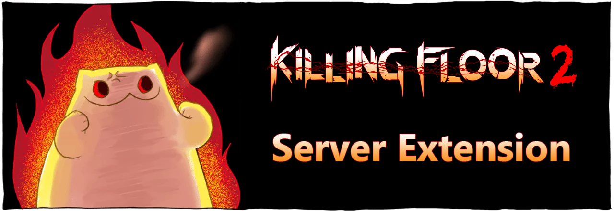

***

*This mod replaces current perk system in [Killing Floor 2](https://en.wikipedia.org/wiki/Killing_Floor_2) with a serverside perk progression with RPG elements, which let you buy individual stats and traits.*

*This is a further development of the ServerExt mutator from [Marco](https://forums.tripwireinteractive.com/index.php?threads/mutator-server-extension-mod.109463) and [Forrest Mark X](https://github.com/ForrestMarkX/KF2-Server-Extension).*

# Features
- RPG elements (traits and stats);
- New menu system;
- Scoreboard that supports unlimited playercount on server;
- Supports custom characters and weapons;
- Enhanced HUD feedback (kill/damage messages);
- First person legs and backpack weapon;
- **Customizable experience for killing custom zeds;**
- **DLC weapons are available for purchase from the trader;**
- **Localization support.**

The full changelog is available on [steam workshop](https://steamcommunity.com/sharedfiles/filedetails/changelog/2085786712).

***

**Note:** If you want to build/test/brew/publish a mutator without git-bash and/or scripts, follow [these instructions](https://tripwireinteractive.atlassian.net/wiki/spaces/KF2SW/pages/26247172/KF2+Code+Modding+How-to) instead of what is described here.

# Build
1. Install [Killing Floor 2](https://store.steampowered.com/app/232090/Killing_Floor_2/), Killing Floor 2 - SDK and [git for windows](https://git-scm.com/download/win);
2. Open git-bash in the folder: `C:\Users\<USERNAME>\Documents\My Games\KillingFloor2\KFGame`
3. Clone this repository and go to the source folder:  
`git clone https://github.com/inklesspen1scripter/KF2-Server-Extension ./Src && cd ./Src`
4. Run make.sh script:
`./make.sh --compile`
5. The compiled files will be here:  
`C:\Users\<USERNAME>\Documents\My Games\KillingFloor2\KFGame\Unpublished\BrewedPC\Script\`

# Testing
You can check your build using the `make.sh` script.  
Open git-bash in the source folder and run the script:  
`./make.sh --test`  
On first launch, the script will create `testing.ini` file and launch the game with the settings from it (KF-Nuked map + ServerExtMut). Edit this file if you need to test the mutator with different parameters.

# Using and configuring ServerExt
A detailed manual is available on the [mod page](https://steamcommunity.com/sharedfiles/filedetails/?id=2085786712) in the steam workshop.

# Publication in steam workshop
1. Modify the publish files if necessary, they are here:  
`C:\Users\<USERNAME>\Documents\My Games\KillingFloor2\KFGame\Src\PublicationContent\`
> description.txt  
> preview.png  
> tags.txt  
> title.txt  
2. Run this command in the source folder:  
`./make.sh -c && ./make.sh -bu && ./make.sh -u`

# Contributing
**Participation is welcome!**

## Bug reports
If you find a bug, go to the [issue page](https://github.com/inklesspen1scripter/KF2-Server-Extension/issues) and check if there is a description of your bug. If not, create a new issue.  
Describe what the bug looks like and how we can reproduce it.  
Attach screenshots if you think it might help.

If it's a crash issue, be sure to include the `Launch.log` and `Launch_2.log` files. You can find them here:  
`C:\Users\<USERNAME>\Documents\My Games\KillingFloor2\KFGame\Logs\`  
Please note that these files are overwritten every time you start the game/server. Therefore, you must take these files immediately after the game crashes in order not to lose information.

## Localization
The mutator supports localization and you can help translate it into other languages.  
It does not require any special knowledge or programming skills, so you just need to know the language into which you will translate.  
Here's a quick guide on how to do it: [localization guide](https://steamcommunity.com/workshop/filedetails/discussion/2085786712/2942494909176752884)

## Contribute code
You can help improve ServerExt by fixing bugs and adding new features.  
Before making a pull request, make sure that:  
1. Your code is working correctly.  
2. Your code does not break existing features.  

In the description of the pull request, describe the changes you made.

# License
The mutator is licensed under the [GNU GPLv3](https://www.gnu.org/licenses/gpl-3.0.en.html) so you are free to use, modify, and redistribute this code, but you must keep the authors credits in the derivative work.

***

**Note about the banner:**  
The cat in the picture is [meowbin](https://www.deviantart.com/cottonvalent/gallery/48815375/creepy-cat). And [Cotton Valent](https://www.deviantart.com/cottonvalent) is the artist who designed and painted this magnificent cat.
